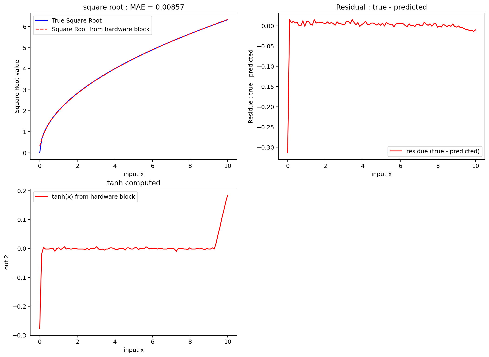

<!---

This file is used to generate your project datasheet. Please fill in the information below and delete any unused
sections.

The peripheral index is the number TinyQV will use to select your peripheral.  You will pick a free
slot when raising the pull request against the main TinyQV repository, and can fill this in then.  You
also need to set this value as the PERIPHERAL_NUM in your test script.

You can also include images in this folder and reference them in the markdown. Each image must be less than
512 kb in size, and the combined size of all images must be less than 1 MB.
-->

# tiny CORDIC

Author: Maciej Lewandowski

Peripheral index: n7

## What it does

This repository implements a Coordinate Rotation Digital Computer (CORDIC) engine that computes common math functions using only adds, subtracts, and shifts. Supported operations include $sin(x)$, $cos(x)$, $sinh(x)$, $cosh(x)$, square root, and fixed-point multiplication and division—all in a few clock cycles.


## Brief introduction to CORDIC 

Trigonometric functions, Multiplication, division are fundamental operations, often required in engineering. They can be often encountarerd in digital signal processing or control. While it is possible to store the trigonometric functions in memory as lookup tables and interpolate, this might require large amount of memories. There exists however a elegant solution of computing these values quite fast, using only additions, subtractions and shifts with a tiny memory footprint. This solution is coordinate rotation digital computer (CORDIC), proposed by Jack E. Volder in 1959 [1] and it can be found in a range of real world microcontrollers for low power, like STM32L031 [2], STM32F031 [2] or other [3]. 

The idea behind the CORDIC algorithm is quite simple and powerful, which allows to compute many different functions like : $sin(x)$, $cos(x)$, $sinh(x)$, $cos(x)$, $\sqrt{x}$, $exp(x)$, $ln(x)$, $a \cdot b$ and $\frac{a}{b}$ using the same hardware. This algorithm is often coverted in standard textbooks and notes [4, 5], therefore only a brief description, to understand how to interact with the underlying hardware with some visualization, to understand it intuitively.

CORDIC is iterative algorithm (in this implementation it takes 12 iterations/clock cycles to compute any function ), and in most general, unified form, this algorithm and designed hardware solves a following set of equations : 


- where $x_i, y_i$ and $z_i$ are inputs to the module dependent on what we want to compute. 
- In its most basic functionality, CORDIC has 3 distinct modes of operations : Circular (m = 1), Linear (m = 0) and Hyperbolic (m = -1). 
- Each of these 3 modes, have two submodes : this configures, which of the values we will drive towards 0 and is represented by $\sigma_j$. These modes are known as Rotation ($\sigma_{j} = sign(z_j)^{+}$) and Vectoring ($\sigma_{j} = -sign(y_j)^{+}$)

### Operating modes 
Let $A,B$ be the register inputs and $out1, out2$ the outputs.

To compute any of the previously mentioned functions, user has to set the mode m and select whether it is rotating or vectoring configuration, and then specify the inputs. In majority of useful cases, we only have to set at most two values, and module can set automatically 3rd value. While setting up 3 values allows to compute more, these functions are often combination of basic functions (for example, outputs would compute Acos(a) + B sin(a), whiile useful, this was done to save resources). Therefore, only two values has to specifed and we denote them A and B. There are also two outputs, out1 and out2. Because there exists quite a few combinations, and some less obvious identities, the table below shows, setting to what mode gives what values :

| Mode (m)|  Submode    | A |B | out1 | out 2|
|---------|--------------|:------:|-------------|-|-|
| 1    | Rotating       |  a   | - |$cos(a)$|$sin(a)$|
| 1    | Vectoring      |  a    | b |$\sqrt{a^2+b^2}$|$tan^{-1}(\frac{b}{a})$|
| 0    | Rotating     |   a    | b |$a \cdot b$| error $\epsilon$|
| 0    | Vectoring |   a    | b | $\frac{b}{a}$| error $\epsilon$|
| -1    | Rotating      |   a    | b | $cosh(a)$ | $sinh(a)$|
| -1    | Vectoring     |   a    |  b | $K_{C} \sqrt{a^2 - b^2}$ |$tanh^{-1}(\frac{b}{a})$|
| -1    | Vectoring    |   a + 1.0    | b - 1.0 |$2 K_{H}\sqrt{a}$|error $\epsilon$|

- Circular gain: $K_C \approx 1.646760$ (RTL pre-scales rotating path by $K_C^{-1}$ → true $\cos,\sin$.
- Hyperbolic gain: $K_H \approx 1.207497$. Rotating path is pre-scaled → true $\cosh,\sinh$.  
- Vectoring path is **not** scaled (software may multiply by $K_H$ if desired).


### References
- [1] [J. E. Volder, "The CORDIC Trigonometric Computing Technique," in IRE Transactions on Electronic Computers, vol. EC-8, no. 3, pp. 330-334, Sept. 1959, doi: 10.1109/TEC.1959.5222693.](https://ieeexplore.ieee.org/document/5222693)
- [2] [STM32 DT0085 application note : Coordinate rotation digital computer algoritm (CORIDIC)](https://www.st.com/resource/en/design_tip/dt0085-coordinate-rotation-digital-computer-algorithm-cordic-to-compute-trigonometric-and-hyperbolic-functions-stmicroelectronics.pdf)
- [3] [Application note AN5325 : How to use the CORDIC to perform mathematical functions on STM32 MCUs](https://www.st.com/content/ccc/resource/technical/document/application_note/group1/50/31/98/a8/b5/da/4e/a4/DM00614795/files/DM00614795.pdf/jcr:content/translations/en.DM00614795.pdf)
- [4] [CORDIC ALGORITHM AND IMPLEMENTATIONS](https://web.cs.ucla.edu/digital_arithmetic/files/ch11.pdf) 
- [5] [Chapter 24 : CORDIC Algorithms and Architectures](https://people.eecs.berkeley.edu/~newton/Classes/EE290sp99/lectures/ee290aSp996_1/cordic_chap24.pdf)

## Sweeps
There is strong dependency of accuracy of the obtained results versus the number of iterations (not as much on width). Written tests perform input sweeps for range of values (100-200 points). Plots of values obtained by the presented module can be found in the `test` github action and they are attached in following subsections. On the following plots we capture the obtained waveform (in fixed point)

### Computed Sin(x) value (verilog simulation compared against python numpy values)


### Computed Cos(x) value (verilog simulation compared against python numpy values)


### Computed Sinh(x) value (verilog simulation compared against python numpy values)


### Computed Cosh(x) value (verilog simulation compared against python numpy values)


### Computed sqrt value (verilog simulation compared against python numpy values)
The value is obtained from out 1, then shifted by 2 and multiplied by inverse of $K_{h} \approx 1.2075$, then the value is compared against the value obtained from numpy.


## Register map

Document the registers that are used to interact with your peripheral

| Address | Name         | Access | Description |
|--------:|--------------|:------:|-------------|
| 0x00    | config       |  R/W   | Control bits {is_rot, mode[1:0], en}. See §Config (0x00). |
| 0x01    | input A      |   W    | Operand A (per-mode; see details). |
| 0x02    | input B      |   W    | Operand B (per-mode; see details). |
| 0x03    | 1.0 position |   W    | Q-format selector (e.g., 11 ⇒ Q5.11; 14 ⇒ Q2.14). |
| 0x04    | output 1     |   R    | Primary result. |
| 0x05    | output 2     |   R    | Secondary result / diagnostic. |
| 0x06    | status       |   R    | 0=ready, 1=busy, 2=done. |


## Detailed description of the registers

### Config (0x00)
| Bits  | Name   | Meaning                               |
|:-----:|--------|----------------------------------------|
| [3]   | is_rot | 1 = Rotating, 0 = Vectoring            |
| [2:1] | mode   | 00=CIRCULAR, 01=LINEAR, 10=HYPERBOLIC |
| [0]   | start  | Write 1 to start; auto-clears          |

### input A (0x01)
- __Circular and Rotating mode__ : angle represented as radian in signed fixed point format. For 16 bit mode, this corresponds to  Q2.14 value.
- __Circular and Vectoring mode__: denotes first input, for which we will compute the magnitude and atan, which is $\sqrt{a^2 + b^2}$. This is represented as a Q2.14 value.
-  __Linear and Rotating mode__: A represents first multiplicand in variable fixed point format. To control on where the position of 1.0 is, register 0x03 has to be used. To given an example,  if register 0x03 is set to 11, this input (A) and input (B) represent value in Q5.11 format.
- __Linear and Vectoring mode__: A represents denominator ($\frac{B}{A}$) in variable fixed point format : to control on where the position of 1.0 is. To given an example,  if register 0x03 is set to 11, this input (A) and input (B) represent value in Q5.11 format. 
- __Hyperbolic and Rotating mode__ : the value for which we will compute the sinh(A) and cos(A) represented in Q2.14 fixed point representation. An important limitation here is range : due to lack of resources, the input has to be in range[-1.1161, 1.1161]. It is possible to extend this range using some hyperbolic identities (more clock cycles required though). 
- __Hyperbolic and Vectoring mode__ :  first input A for hyperbolic mode. The output here can represent any fixed point __as long as it is greater then second input B__ ($\sqrt{A^2 -B^2}$ becomes undefined then), because the output is __not scaled__ (not multiplied by $K_{1}$ due to resource limitations). It is up to user to either multiply by $K_{1}\approx \frac{1}{0.82816} \approx 1.207496$ or use it the computed value of $K_{1} \sqrt{A^{2} - B^{2}}$. <br>

### input B (0x02)
- __Circular and Rotating mode__ : not used. 
- __Circular and Vectoring mode__: denotes second input, for which we will compute the magnitude and atan, which is $\sqrt{a^2 + b^2}$. This is represented as a Q2.14 value. 
- __Linear and Rotating mode__: A represents second multiplicand in variable fixed point format  : to control on where the position of 1.0 is. To given an example,  if register 0x03 is set to 11, this input (A) and input (B) represent value in Q5.11 format.
- __Linear and Vectoring mode__: B represents nominator ($\frac{B}{A}$) in variable fixed point format. To control on where the position of 1.0 is, register 0x03 has to be used. To given an example,  if register 0x03 is set to 11, this input (A) and input (B) represent value in Q5.11 format. 
- __Hyperbolic and Rotating mode__ not used. 
- __Hyperbolic and Vectoring mode__ :  Second value B for hyperbolic mode. __this value has to be smaller then A, otherwise result will be incorrect__. The output here can represent any fixed point. The output is __not scaled__ (not multiplied by $K_{1}$ due to resource limitations). It is up to user to either multiply by $K_{1}\approx \frac{1}{0.82816} \approx 1.207496$ or use it the computed value of $K_{1} \sqrt{A^{2} - B^{2}}$.

### Output 1 (0x04)
 - __Circular and Rotating mode__ : returns cos(A), stored in Q2.14 format. 
 -  __Circular and Vectoring mode__: returns $K_{C} \cdot \sqrt{A^2 + B^2}$ where $K_{C} = 1.64676$.
 -  __Linear and Rotating mode__: returns $A \cdot B$ in a fixed float format configured by the register 0x03. <br> - __Linear and Vectoring mode__: returns $\frac{B}{A}$ in a fixed float format by the register 0x03. 
 - __Hyperbolic and Rotating mode__ : returns cosh(A) stored in Q2.14 format. 
 - __Hyperbolic and Vectoring mode__ :  returns $K_{H} \cdot \sqrt{A^2 - B^2}$ where $K_{H} \approx 0.82816$. The output is not scaled : this means that it is up to programmer and software to interpret this value (with consistent format of A, B and $K_H$ its possible to get wide range of fixed points) <br>

### Output 2 (0x05)
- __Circular and Rotating mode__ : returns sin(A), stored in Q2.14 format. 
- __Circular and Vectoring mode__: returns $tan^{-1}(\frac{B}{A})$ 
- __Linear and Rotating mode__: In the unified CORDIC this returned value corresponds to final value of $z$ (z after N iterations). This value is quite difficult to interpret, but it is somehow dependent on the error. In ideal case this should be 0 (in which case the output 1 corresponds to correct value). Large magnitude values can indicate that the conversion was unsuccessful. 
- __Linear and Vectoring mode__: In the unified CORDIC this returned value corresponds to final value of $y$ (y after N iterations). This value is quite difficult to interpret, but it is somehow dependent on the error. In ideal case this should be 0 (in which case the output 1 corresponds to correct value). Large magnitude values can indicate that the conversion was unsuccessful. 
- __Hyperbolic and Rotating mode__ : returns sinh(A) stored in Q2.14 format.
- __Hyperbolic and Vectoring mode__ :  returns $tanh^{-1}(\frac{y}{x})$ stored in Q2.14 format <br>

### Status (0x06)
| Value | Meaning |
|:----:|---------|
| 0    | ready   |
| 1    | busy    |
| 2    | done    |

## How to test
This section explains how to test and use this peripheral with examples. 
### trigonetric function (sin and cos)
CORDIC allow you to get sin and cosine value from ~ -99. to 99 degrees [] simulataneously. The input is an angle. An example use of getting sin and cosine of 30 degrees (which is pi/6 \approx 0.52359877, which corresponds to b00100001_10000011 ).

```
// convert angle to fixed point value to angle
angle = b00100001_10000011

// set the angle of the cordic
write_to_register(1, angle)

// configuration : set the mode to ROTATING, CIRCULAR, RUNNING
write_to_register(0,                      0b1_00_1)

// wait few clock cycles : either check the status register 
// 6 or wait for interrupt, or for 10 clock cycles
while (read_the_register(6) == 1) // 1 denotes BUSY, 2 denotes ONE
{

}

// read the result 
cosine_of_angle = read_the_register(4)
sine_of_angle = read_the_register(5)
```

### multiplication 
Multiplication can be done using linear (m = 0) and rotating mode. In this case, we have to set the 3 registers : input A (0x01), input B(0x02) and select where 1.0 is (0x03). Below there is an example of multiplication of 1.25 * 2.5 with in Q5.11 format (iiiii_ddddddddddd)

```
// set the position of alpha 
WHERE_IS_ONE = 11
write_to_register(3, WHERE_IS_ONE)

// convert A=1.25 to fixed point. A = 2^{0} + 2^{-2} = 00001_01000000000
A = 0b00001_01000000000 // 2560

// convert B=2.5 to fixed point. A = 2^{1} + 2^{-1}  = 00010_10000000000
B = 0b00010_10000000000 // 5120

// put the value of A into register
write_to_register(1, A)

// put the value of B into register
write_to_register(2, B)

// configuration : set the mode to ROTATING, LINEAR, RUNNING
write_to_register(0,                      0b1_01_1)

// wait few clock cycles : either check the status register 
// 6 or wait for interrupt, or for 10 clock cycles
while (read_the_register(6) == 1) // 1 denotes BUSY, 2 denotes ONE
{

}

// read the result 
out1 = read_the_register(4)
error = read_the_register(5)

```

### Division 
Division can be done using linear (m = 0) and vectoring mode. In this case, we have to set the 3 registers : input A (0x01), input B(0x02) and select where 1.0 is (0x03). Below there is an example of division of 9.12 / 6.3 with in Q5.11 format (iiiii_ddddddddddd)

```
// set the position of alpha 
WHERE_IS_ONE = 11
write_to_register(3, WHERE_IS_ONE)

// convert A=6.3 to fixed point.  A = 0b00110_01001100110
A = 0b00110_01001100110 // 12902

// convert B=9.12 to fixed point. A = 0b01001_00011110110
B = 0b01001_00011110110 // 18678

// put the value of A into register
write_to_register(1, A)

// put the value of B into register
write_to_register(2, B)

// configuration : set the mode to VECTORING, LINEAR, RUNNING
write_to_register(0,                      0b0_01_1)

// wait few clock cycles : either check the status register 
// 6 or wait for interrupt, or for 10 clock cycles
while (read_the_register(6) == 1) // 1 denotes BUSY, 2 denotes ONE
{

}

// read the result 
out1 = read_the_register(4)
error = read_the_register(5)

```

### sinh and cosh 
CORDIC allow you to get sinh and cosh value from [-1.1161, 1.1161] simulataneously. It is possible to obtain larger values then that in software using hyperbolic identities. An example use of getting sinh and cosh of ln (2) (which is 0.69314, which corresponds to b00100001_10000011 ).


```
// convert A = ln(2) = 0.693147 which is approximately 00_10110001011101
A = 0b00_10110001011101 // 11357

// put the value of A into register
write_to_register(1, A)

// configuration : set the mode to ROTATING, HYPERBOLIC, RUNNING
write_to_register(0,                      0b1_10_1)

// wait few clock cycles : either check the status register 
// 6 or wait for interrupt, or for 10 clock cycles
while (read_the_register(6) == 1) // 1 denotes BUSY, 2 denotes ONE
{

}

// read the result 
cosh = read_the_register(4)
sinh = read_the_register(5)
```

### Square root 
The vectoring mode in hyperbolic mode might at the first sight might not lookg very interesting, however it allows to compute many interesting functions (such as square root, ln, exp etc.). In here, let's use the square root mode, by inputting A = x + 1 and B = x -1. This gives 
$$out1= K_{H}\sqrt{(x+1)^2 -(x-1)^2} =K_{H} \sqrt{x^2 +2x + 1 - x^2 + 2x - 1} = 2K_{H} \sqrt{x}$$
Due to hardware limitation, the output is not scaled. It is up to programmer to interpret the value, and multiply with fixed point that matches the specification.
In the example below we compute square root of 2.5, which is specified in Q5.11 format
```
// input is x=2.5 in Q5.11 
// to compute square root we need to set A = x + 1
// to compute square root we need to set B = x - 1

// convert A=3.5 to fixed point.
// A = 2^{2} + 2^{0} + 2^{-1} = 00011_10000000000
A = 0b00011_10000000000

// convert B=1.5 to fixed point.
// A = 2^{0} + 2^{-1}  = 00001_10000000000
B = 0b00001_10000000000 

// put the value of A into register
write_to_register(1, A)

// put the value of B into register
write_to_register(2, B)

// configuration : set the mode to VECTORING, HYPERBOLIC, RUNNING
write_to_register(0,                      0b1_10_1)

// wait few clock cycles : either check the status register 
// 6 or wait for interrupt, or for 10 clock cycles
while (read_the_register(6) == 1) // 1 denotes BUSY, 2 denotes ONE
{

}

// read the result 
out = read_the_register(4)

// output here will be 2 * K_{h} * sqrt(x)
```


## External hardware

- None required this is mainly extension for core, to allow computing of trigonometric functions , multiplication, division, hyperbolic and square root. This can have many applications in audio ( generating sine values or cose values) or in control (in motor control). 